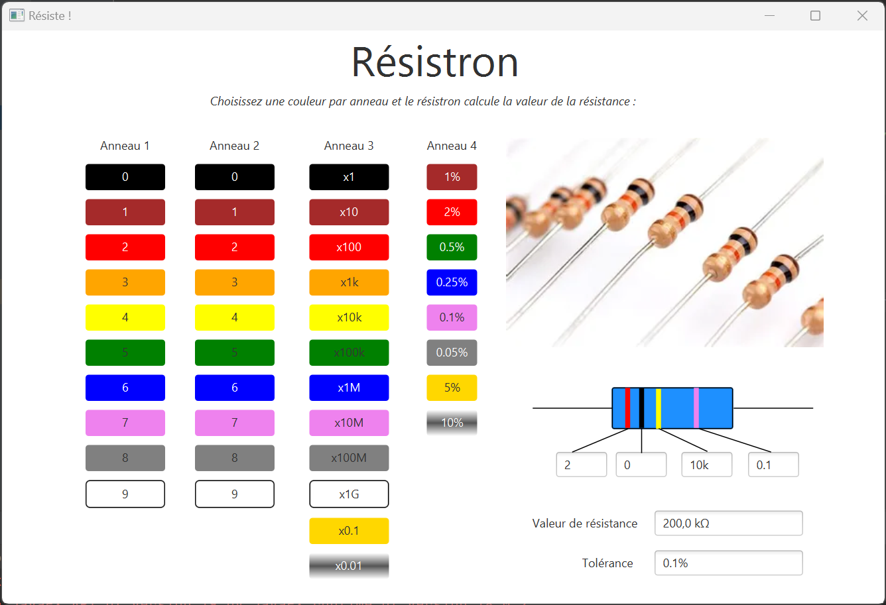

# RESISTRON

Cette application sert à calculer la valeur d'une résistance en électronique.

## Mode d'emploi :

- Dans la première colonne, la couleur de l'anneau détermine le chiffre des dizaines
- Dans la seconde colonne, la couleur détermine le chiffre des unités.
- Dans la troisième colonne, la couleur correspond au multiplicateur du nombre obtenu précédemment.
- Dans la dernière colonne, la couleur correspond à la tolérance.

Pour chaque anneau de la résistance vous devez donc choisir sa couleur
grâce aux boutons qui correspondent à cet anneau.

Le calcul se fait ainsi automatiquement et s'affiche en bas à droite
dans les champs `Valeur de la résistance` et `Tolérance`.

## Licence

Pas de licence.